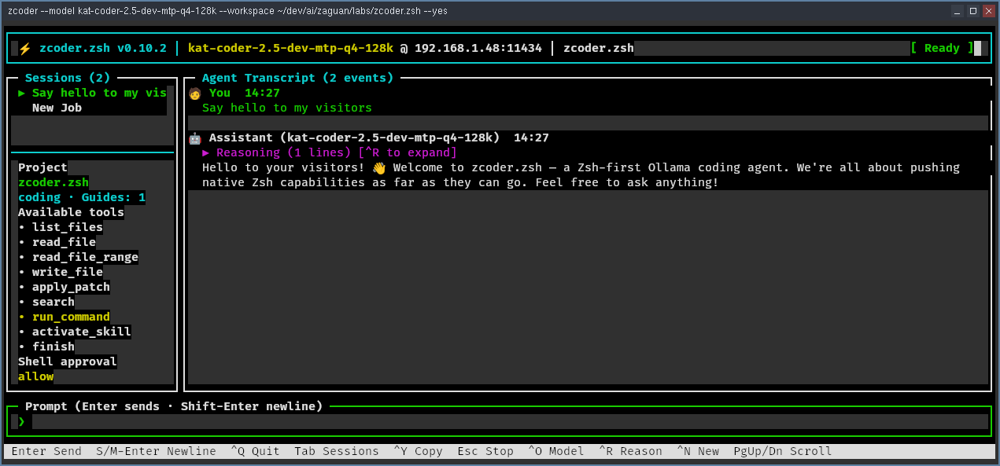

# zcoder.zsh

**A capable coding agent for Ollama, built almost entirely in Zsh.**

zcoder works inside a directory you choose. It can explore a project, read and
edit files, apply patches, run tests, and keep working through multi-step tasks
until the job is complete. You get a focused terminal interface, local model
execution, and a clear approval prompt before any shell command runs.



It is deliberately small and inspectable. Application logic—including HTTP,
JSON, session storage, tool dispatch, and the interface—uses native Zsh modules.
External tools are used where they are the actual capability: `rg` for search,
`git` or `patch` for patches, and your shell for approved commands.

## Why try it?

- **Local by default.** Use any Ollama model with tool-calling support.
- **Useful on real projects.** Search, edit, patch, test, and iterate from one conversation.
- **Bounded and reviewable.** File tools stay inside the workspace; shell commands ask first.
- **Project-aware.** Hierarchical `AGENTS.md`, Agent Skills, and stdio MCP tools are built in.
- **Warm on arrival.** The interactive TUI loads the model and stable project context while you type.
- **Coordinates local work.** Running instances on the same machine can discover each other and hand off tasks through a private Unix socket relay.
- **Available across your network.** Run the agent beside a remote workspace and control it from your local TUI.
- **Available to ACP clients.** Run zcoder as an External Agent locally or bridge ACP to a remote zcoder server.
- **No application framework.** Just Zsh 5.8+, its standard modules, and a handful of purpose-specific tools.

## Try it

You need Zsh 5.8 or newer, a running Ollama server, a tool-capable model, and
`ripgrep`. Install `git` or `patch` if you want the agent to apply changes.

```sh
ollama pull qwen3-coder
git clone https://github.com/ZaguanLabs/zcoder.zsh.git
cd zcoder.zsh
./zcoder.zsh --model qwen3-coder --workspace /path/to/project
```

Then ask for a concrete outcome:

```text
Find the cause of the failing tests, make the smallest safe fix, and verify it.
```

Prefer a non-interactive run? Use `--prompt`:

```sh
./zcoder.zsh --model qwen3-coder --workspace . \
  --prompt "Inspect this project and explain how it is organized"
```

## Remote workspaces

zcoder can also run headlessly on the machine that owns the model and workspace.
The local instance becomes a thin client: prompts travel to the server, every
tool runs remotely, and command approvals return to your local terminal.

For browser access, [zcoder-web](https://github.com/ZaguanLabs/zcoder-web) is a
lightweight web interface that connects to one or more zcoder.zsh servers.
Manage remote sessions, send prompts, and approve commands from your desktop
or phone.

See the [remote-agent guide](docs/remote.md) for setup and security guidance.

## ACP clients

Run `./zcoder.zsh --acp` to expose zcoder as an Agent Client Protocol v1
agent over stdio. It can use the local runtime directly or connect through the
existing authenticated remote API with `--acp --connect HOST`.

See the [ACP guide](docs/acp.md) for client configuration, supported
capabilities, and remote deployment.

## Documentation

- [Getting started](docs/getting-started.md)
- [Interface and sessions](docs/interface.md)
- [Remote-agent server](docs/remote.md)
- [Agent Client Protocol](docs/acp.md)
- [Safety and permissions](docs/safety.md)
- [Project guidance and Agent Skills](docs/project-guidance.md)
- [MCP servers](docs/mcp.md)
- [Configuration and context management](docs/configuration.md)
- [Inter-agent communication](docs/inter-agent-communication.md)
- [Architecture](docs/architecture.md)
- [Development](docs/development.md)

Start with the [documentation index](docs/README.md) if you are not sure where
to look.

## License

[MIT](LICENSE)
